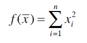

# es_func_opt (WIP)
Evolutionary strategy algorithm for function optimizing.

The goal is to optimize the function:

using the evolutionary strategy. The population consists of possible solutions (combinations) of xi and sigma: the number which controles the rate of mutation and mutates itself.
